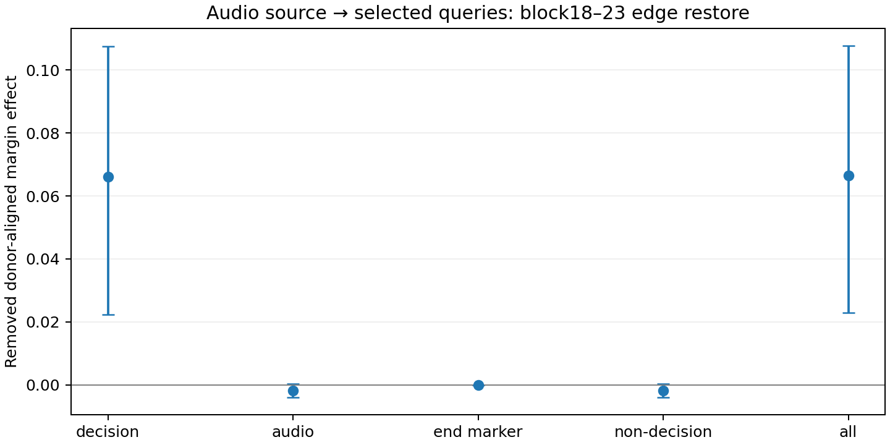

# Audio-source × query edge restore：主要效应位于 decision 读取边

日期2026-09-15。冻结SLAM-Omni-0.5B；RAVDESS speech intensity01，192样本、96严格matched pairs、24actors，seed1234。继续使用post-block17 audio donor swap和blocks18–23 joint restore，单token ` happy`/` sad`（6247/12421）。层号、位置均从0开始。

**结果接近情况A：decision-only M=+0.06610，all-query M=+0.06653；non-decision的M为−0.00184且CI跨0。当前条件干预支持后续attention的audio-V→decision-query读取边承载主要margin效应。** 没有把移除量换算成独立中介百分比。

## 干预定义与范围

Source固定audio=[29,329)。Query分别为decision={330}、audio=[29,329)、end-marker={329}、non-decision=[0,330)、all=[0,331)。前置prompt和输入标记无法关注未来audio，其局部增量应为0。

对每个block/head，在pre-o_proj使用当前干预轨迹的Q/K及其attention weights A：

O_restore[q] = O_current[q] + sum_{s in audio} A_current[q,s] (V_clean_target[s] − V_current[s])。

仅更新选定query行，其他query在该block的pre-o_proj输出保持不变。不移植clean Q/K或clean attention weights。局部保留当前Q/K，不意味着早层干预不会影响后续层Q/K。实现保留SDPA后端，使用真实RoPE、GQA与绝对query位置的causal mask。

M=donor_sign×(S_patch−S_restore)，happy target取−1、sad target取+1，再在pair内平均。S为单token happy−sad log-likelihood margin；原始patch CE=+0.04555。

## 五组query结果

下表为移除量M；全部CI为10,000次actor-cluster bootstrap的95%区间，numpy seed20260915，未做多重比较校正。

| Query被恢复 | M | 95% actor CI |
|---|---:|---:|
| decision only | +0.066100 | [+0.022349, +0.107487] |
| audio queries only | -0.001849 | [-0.003912, +0.000322] |
| end-marker only | +0.000001 | [-0.000022, +0.000024] |
| all non-decision queries | -0.001845 | [-0.003912, +0.000336] |
| all queries | +0.066528 | [+0.022835, +0.107766] |

**Decision−all = −0.000428 [−0.002036,+0.001176]。** 均值及差值区间显示两者很接近，但没有预设实质等价界，不能把CI跨0直接写成正式等价。

**Decision−non-decision = +0.067945 [+0.024225,+0.109851]。** 直接配对比较支持decision edge恢复的移除量明显大于non-decision条件，而非仅比较两个条件是否各自显著。

Audio-query与non-decision的差值只有−4.37×10⁻⁶，end-marker效应约9.42×10⁻⁷；本轮没有得到大的audio-query内部或marker桥梁的正向移除效应。Audio/non-decision的负均值CI均跨0，不能据此声称稳定抑制路径。

非加性诊断all−decision−non-decision = +0.002272 [−0.000235,+0.004752]。此轮该交互估计CI跨0，未形成稳定的非加性证据，但也不证明这些恢复干预可作独立线性分解。不能把decision/all的比值解释为中介百分比。

## 机制解释

与上一轮source-only结果合起来，证据支持在当前条件下的局部路径：

**post17 altered audio state → 后续audio-position V → attention读取到decision query → decision residual → 单token margin。**

这比source-only恢复更直接：本轮已经将query限定到decision，且该条件的移除量接近all-query参考，而非decision-query条件很小。结果不支持“本轮主要效应由audio-V先写入其他query再传到decision”的解释。

结论仍限于blocks18–23、固定checkpoint/prompt/verbalizer与此matched-pair干预。被decision读取的audio values可能已在更早层或同层前序计算中传播/重编码；non-decision条件也只切audio-V输入边，没有穷尽经K/routing或residual的其他间接路径。它不是“模型没有任何multi-hop计算”的证明，更不是自然emotion-specific利用或分类可靠性已被建立。原始patch的分类基线仍沿用之前的chance行为；本轮测的是小幅margin影响。

## 验证与复现

- 完整960行（192×5）；每条clean/patched基线跨条件精确一致，且与上一轮一致。
- 全192样本edge-all与普通audio-source V restore的margin最大差 **4.29×10⁻⁶**；与上一轮source-audio结果的最大差同为4.29×10⁻⁶。
- 当前attention输出重建最大坐标误差 **1.45×10⁻⁴**，低于运行前容限1×10⁻³；保留SDPA后端。
- 非选定query局部输出变化、前置query增量、首样本各条件self restore及self audio patch误差均为 **0**。
- 全样本clean/patched prefix-only与原teacher-forced scorer最大差分别1.53×10⁻⁵、1.43×10⁻⁵。
- 远端 **37/37测试通过**；本地27 passed、8 skipped（无torch）。Python编译、shell语法和diff检查通过。首次启动的同名scripts包导入冲突已修复，并增加从仓库外直接运行脚本的回归测试。
- 复用已有source恢复、模型加载和配对统计工具，仅新增edge计算与分析，无新依赖、无训练、无权重修改。

[运行前口径](./experiment-spec.md) · [逐样本结果](./effects.csv) · [运行元数据](./effects_run.json) · [汇总](./analysis/edge_summary.csv) · [配对差值](./analysis/edge_contrasts.csv) · [验证记录](./verification.json) · [复现命令](./reproduce.sh)
