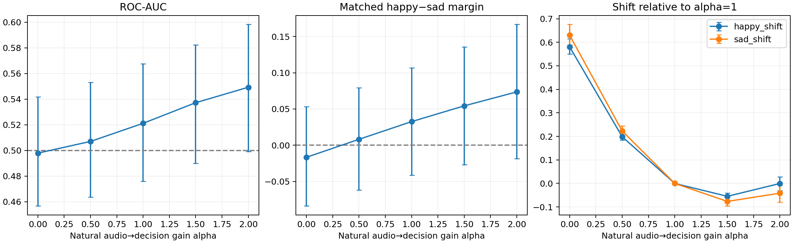
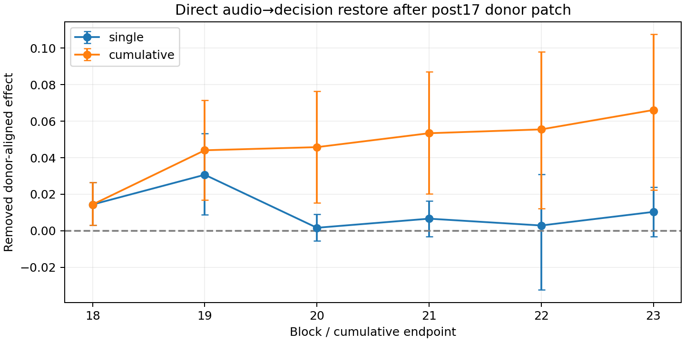

# 自然 audio→decision edge：弱情绪信号与强 SAD 偏置并存

2026-09-15。先完成clean necessity/gain，再运行低优先级的donor-background block restore。模型冻结；192样本、96严格happy/sad pairs、24actors、intensity01、seed1234；同一单token ` happy`/` sad`（6247/12421）。干预范围为零起点blocks18–23、source audio positions [29,329)、decision query330。

## 1. Clean edge necessity

自然forward没有layer17 donor patch。移除这些block的audio-V→decision贡献（alpha=0），定义C(x)=S_clean−S_removed，DeltaC=C_happy−C_sad。C是联合边移除的总下游效应，不是静态线性归因或全部模型层的必要性。

| 指标 | 均值 | 95% actor-bootstrap CI |
|---|---:|---:|
| C_happy | −0.58060 | [−0.61502,−0.55017] |
| C_sad | −0.62983 | [−0.67579,−0.58838] |
| **DeltaC** | **+0.04923** | **[+0.00794,+0.09497]** |
| DeltaC>0 的pair比例 | 61.46%（59/96） | [51.04%,71.88%] |

两类C都为负，说明这组自然边整体把margin推向SAD；但sad样本受到的负向影响平均更强，形成正向DeltaC。因此不能把“C整体负”误解成emotion方向必然错误：**共同的SAD平移和弱的正确情绪差异同时存在。** 37/96对DeltaC为负，不能说每个context都稳定同向。

Statement01的DeltaC均值+0.06547、正向比例70.83%；statement02为+0.03299、52.08%。这些是探索性分组描述，不是跨statement泛化测试或组间显著差异结论。全部actor分组保存在context CSV。

## 2. Clean gain sweep

对每个被干预block，在pre-o_proj执行 O_decision += (alpha−1)A_current V_current_audio。保留局部当前Q/K，不重新归一attention；前面的gain会影响后面decision state/query，所以这不是固定轨迹上的线性放大。

| alpha | Accuracy | ROC-AUC | Pair H−S均值 | 正向pair比例 | Happy/Sad margin均值 |
|---|---:|---:|---:|---:|---:|
| 0 | 50.0% | 0.4979 | -0.01665 | 47.92% | -3.4336 / -3.4170 |
| 0.5 | 50.0% | 0.5071 | +0.00817 | 47.92% | -3.8159 / -3.8240 |
| 1 | 50.0% | 0.5212 | +0.03258 | 48.96% | -4.0142 / -4.0468 |
| 1.5 | 50.0% | 0.5372 | +0.05431 | 52.08% | -4.0690 / -4.1233 |
| 2 | 50.0% | 0.5493 | +0.07359 | 55.21% | -4.0145 / -4.0880 |

所有alpha下均为192/192 SAD，且没有margin=0的ties。AUC与pair-separation点估计随alpha递增，但正确阈值预测没有改善。

- Alpha2相对alpha1的AUC提升 **+0.02810 [ +0.00271,+0.05111 ]**；alpha1.5提升+0.01606 [+0.00206,+0.02843]。这是共享actor重采样的直接配对变化。
- **Alpha2绝对AUC=0.5493，CI [0.4992,0.5982]仍跨0.5。** 不能把相对改善写成已经获得可靠的绝对分类能力。
- Alpha2相对alpha1的pair gap增加+0.04101，CI [−0.00858,+0.08789]跨0；不能把点估计单调上升写成所有分离指标都获得统计支持。
- Alpha2相对alpha1：happy均值几乎不变（−0.00021），sad均值更负（−0.04122）；不是严格统一平移。相比之下，移除边(alpha0)使两类都明显向happy移动：+0.58060/+0.62983，但仍没有跨过0阈值。

**当前结论：自然边包含弱、平均方向正确的emotion相关信号；共同SAD偏移和总体输出负margin明显，gain至2仍不足以得到可用分类。** 这不支持“自然边完全没有emotion信息”，也尚不能证明失败仅由gain不足或常数校准偏置造成。AUC接近chance、pair方向存在大量反例，需要保留这一限制。本轮没有拟合最优alpha、分类阈值、输出bias或插件。

所有区间为10,000次actor-cluster bootstrap（numpy seed20260915），未做多重比较校正。AUC每次按重采样actor的重复次数计算全部正负样本对，包括跨actor比较，不是平均单actor AUC。Accuracy固定margin>0为happy，否则sad。

## 3. Block-specific direct-edge restore

仍使用post17 matched donor audio patch背景，恢复clean target audio V到decision query；这组结果定位人工patch效应，不替代上述自然edge实验。

| Block | 单block M（95% CI） | 累计18至该block M |
|---|---:|---:|
| 18 | +0.01439 [+0.00302,+0.02636] | +0.01439 |
| 19 | +0.03066 [+0.00875,+0.05322] | +0.04407 |
| 20 | +0.00165 [-0.00539,+0.00911] | +0.04578 |
| 21 | +0.00663 [-0.00321,+0.01629] | +0.05339 |
| 22 | +0.00290 [-0.03230,+0.03100] | +0.05549 |
| 23 | +0.01035 [-0.00304,+0.02389] | +0.06610 |

Block18、19的单独移除量区间高于0；19点估计最大，但没有通过block间直接比较证明其显著大于其他层。累计18–19 M=+0.04407 [0.01695,0.07145]；加入19的配对增量+0.02968 [0.00828,0.05189]。随后各步增量区间均跨0。结果支持18–19已经承载明显效应，尚不能断言后续层无贡献或确定唯一mediator。

累计18–23 M=+0.06610 [0.02235,0.10749]，与历史joint decision-only结果逐样本精确一致。单层和累计restore不是可加中介分解，不解释为百分比。全部区间未校正多重比较。

[逐样本结果](./block_restore.csv) · [运行元数据](./block_restore_run.json) · [完整层级区间](./block_analysis/block_summary.csv) · [累计增量](./block_analysis/cumulative_increments.csv) · [历史复现验证](./block_analysis/verification.json)

## 证据与复现

- [运行前口径](./experiment-spec.md)、[完整复现命令](./reproduce.sh)
- [Clean逐样本分数](./gain.csv)、[运行元数据](./gain_run.json)
- [Gain指标及CI](./gain_analysis/gain_summary.csv)、[与alpha1配对对照](./gain_analysis/gain_contrasts.csv)
- [Necessity汇总](./gain_analysis/necessity_summary.csv)、[逐pair DeltaC](./gain_analysis/necessity_pairs.csv)、[actor/statement描述](./gain_analysis/necessity_context.csv)
- [Clean基线验证](./gain_analysis/verification.json)

模型参数冻结，SDPA后端，float32，torch2.5.1/transformers4.57.6；不修改checkpoint、不训练、无新依赖。
