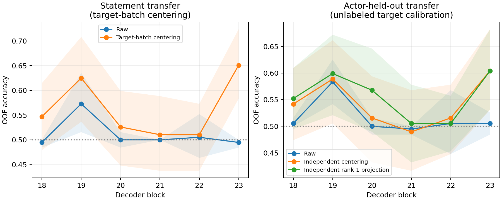

# Edge representation：statement offset 与 emotion geometry

2026-09-15。直接复用clean audio→decision的各层post-o_proj向量，检验跨文本probe的排序与阈值为何分离；本轮不扩展attention路径，不运行模型，不训练插件。

## 口径

192样本、96严格happy/sad pairs、24actors，speech intensity01；blocks18–23逐层分析，19为先前提出的关注层。四个class means定义d01/d02（happy−sad）与o（statement02中点减statement01中点），并训练两个statement各自的标准化logistic probe。比较w时还原到residual坐标，比较intercept时同时考虑系数尺度。

Primary statement-held-out比较原始probe与各domain自行去均值。测试domain均值无标签但来自测试分布，是transductive诊断。Secondary在leave-one-actor-out下，只用其他actors的source及无标签target statement估计offset，用于centering或rank1投影；classifier emotion标签只来自source statement。这隔离了测试actor，但仍使用了target statement的无标签校准数据，不是严格的未知文本induction。

## Geometry结果

| Block | cos(d01,d02) | norm(o) | norm(d_shared) | cos(w01,w02) |
|---|---:|---:|---:|---:|
| 18 | -0.264 | 10.766 | 0.434 | +0.176 |
| 19 | +0.488 | 3.593 | 0.358 | +0.174 |
| 20 | -0.157 | 15.318 | 0.333 | +0.154 |
| 21 | -0.052 | 22.913 | 0.742 | +0.117 |
| 22 | -0.132 | 19.931 | 0.680 | +0.042 |
| 23 | -0.017 | 17.360 | 0.404 | +0.189 |

Block19的d01/d02范数分别0.474/0.355，共享均值方向d_shared=(d01+d02)/2范数0.358。Statement offset范数3.593，约为共享方向范数10倍；不过范数大不自动说明污染分类，关键是投影。

这里o·d_shared=+0.5214，o·d_shared/||d_shared||²=+4.057（offset在该方向上的投影约为共享class-mean gap的4.06倍）。沿两个实际probe的score shift分别为w01·o=−2.761、w02·o=−13.535。二者符号与classmean轴不同，说明“emotion direction”不能不加区分地替换为任一外部分类方向。

Block19的probe raw intercept为b01=−14.572、b02=+19.539，系数范数83.169/79.175；规范化intercept为−0.175/+0.247。**两条probe方向cosine只有0.174，因此不能把这两个intercept差直接解释为同一条轴上的阈值变化。** 更可靠的固定方向诊断是后文同一个w下的offset校正。

同一probe在本statement与另一statement的class-mean score gap也不同：w01为8.783→4.640；w02为9.534→3.577。跨statement仍有正向差异，但均值差缩小。这些是描述性全数据probe几何，不能当成held-out精度或证明最佳线性方向唯一。

Classmean几何提供10,000次actor-bootstrap区间，例如block19 cos(d01,d02)为0.488，percentile区间[−0.040,0.609]，不支持强确定的平行性判断。高维范数、比值与cosine是非线性估计，percentile bootstrap可能有明显偏差，部分指标区间不包含其点估计；保留原始区间而不将其当成精确校准的显著性检验。独立probe方向比较没有伪装成带重拟合的不确定性估计。

## Counterfactual结果

**Offset确实造成一部分固定阈值失效，但修正后没有恢复到70%–80%，不能归结为纯shared direction + shifted threshold。**

| Block | Statement raw → 各domain去均值 | Joint raw → 独立actor校准去均值 | Joint rank1投影 |
|---|---:|---:|---:|
| 18 | 49.48% → 54.69% | 50.52% → 54.17% | 55.21% |
| 19 | 57.29% → 62.50% | 58.33% → 58.85% | 59.90% |
| 20 | 50.00% → 52.60% | 50.00% → 51.56% | 56.77% |
| 21 | 50.00% → 51.04% | 49.48% → 48.96% | 50.52% |
| 22 | 50.52% → 51.04% | 50.52% → 51.56% | 50.52% |
| 23 | 49.48% → 65.10% | 50.52% → 60.42% | 60.42% |

**预先关注的block19：** Statement accuracy57.29%→62.50%，配对提升+5.21pp，95% CI [−2.60,+13.54]；joint58.33%→58.85%，提升+0.52pp [−6.77,+7.29]；rank1为59.90%。因此在19没有建立明确的大幅恢复。

**本轮描述性改善最大的是block23：**

- Statement49.48%→65.10%，提升+15.63pp [8.33,22.92]。使用目标测试batch的无标签均值，是transductive结果。
- 独立actor校准的joint50.52%→60.42%，提升+9.90pp [3.13,17.71]。只用其他23actors估计两句话的均值，不用测试actor样本，也不用target emotion标签。
- Rank1投影同样60.42%，提升+9.90pp [2.60,17.71]；两种方法accuracy相同不表示预测样本或ranking相同，也未证明rank1优于centering。

所有改善区间均为固定拟合条件下的actor-cluster bootstrap，未校正6层、多条件比较。Block23是看到本轮曲线后的描述性重点，不应包装成预注册最佳层。

### 为什么within-fold AUC不变，却能提高accuracy？

保留同一w、只改变target均值后，所有test score平移同一个常数：

`score_centered = score_raw − w·(mu_target−mu_source)`。

因此每个fold的排序完全不变，变的是score=0阈值相对样本的位置。实测全部centering条件的within-fold AUC变化精确为0。

Block19 statement within-fold平均AUC始终0.6849，joint始终0.6615；block23分别始终0.6526/0.6250。但block23 statement pooled AUC从0.5729→0.6566，joint从0.5574→0.6357，这是跨fold的offset对齐，不是每个fold内出现了新增emotion信息。

Rank1投影重新拟合probe，允许改变排序；block23 joint within-fold AUC点估计0.6250→0.6667，但这里未对该within-fold增量提供配对区间，保留为描述性结果。

### 研究问题的更新

“只有offset”与“emotion geometry完全随文本改变”都太强。我们现在有直接的**外部probe阈值污染证据**：只做无标签均值修正就能恢复部分准确率，独立actor校准也有改善；同时恢复后的ranking/accuracy仍有限，且不同statement拟合的probe方向不高度平行。

因此更合适的表述是：**content-conditioned offset贡献了部分跨文本失败，修正offset之后仍残留有限的跨文本可读性。** 这不等于已经证明剩余失败全部来自方向旋转，也没有改变自然模型本身的readout。本轮没有扩大attention路径或训练模型。

## 解释边界

- 每fold的常数平移不能改变其AUC；pooled OOF AUC的变化可能来自fold之间offset对齐，不能解释成更好的局部排序。
- 去均值恢复准确率支持阈值偏移是原因之一，但不自动证明共享emotion方向或自然LM readout已被修复。
- 去掉一个content方向后无改善，也不单独证明emotion方向随文本旋转：可能同时移除了emotion分量，或content影响不是rank1。
- 只有两句话，严格只含一句话的训练集无法估计两句话之间的content方向。独立actor校准所使用的无标签target statement不能被隐藏。
- Actor-bootstrap区间条件于已拟合的probe与均值；没有在bootstrap内重拟合，未校正多层/条件比较。全数据classmean与方向是描述性几何，不是独立测试集上的抽象性证明。

## 复现与验证

- [运行前口径](./experiment-spec.md)、[复现命令](./reproduce.sh)
- [Classmean geometry与区间](./geometry_summary.csv)、[Probe方向与intercept](./geometry_probe_directions.csv)、[Geometry统计口径](./geometry_analysis.json)
- [Counterfactual指标](./counterfactual_summary.csv)、[配对改善区间](./counterfactual_contrasts.csv)、[逐fold指标](./counterfactual_folds.csv)、[逐样本OOF分数](./counterfactual_oof.csv)
- [数值与覆盖验证](./counterfactual_verification.json)、[校准协议](./counterfactual_analysis.json)、[汇总验证](./verification.json)

输入NPZ校验与上轮一致。Class means、probe向量及校准均值的NPZ保留本地与biggpu，不上传Git。代码、CSV、图表与复现记录上传。

验证：远端67项测试通过；本地47通过、18因可选运行时依赖缺失跳过；语法编译、shell语法及历史OOF数值复现均通过。
