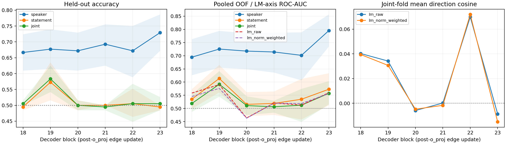
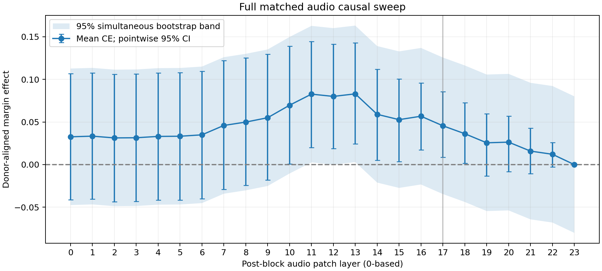

# Clean audio→decision representation 与全层 causal sweep

2026-09-15。研究问题从自然edge的弱信号进一步收窄到：每层实际写入decision residual的audio attention update，是否含有可跨speaker/content读出的emotion信息；外部probe与词表读出方向的关系如何。同时补齐post-block0–23 full-audio matched patch，检查layer17是否只是稀疏扫描选中的点。

## 实验定义

使用原192样本、96严格happy/sad pairs、24actors、speech intensity01。固定原prompt、单token ` happy`/` sad`（6247/12421），模型冻结，不训练插件或修改checkpoint。

每层18–23单独保存 `e_l = W_O,l concat_heads(A_decision,audio V_audio)`，不含o_proj bias，不在audio子集重新归一attention，不跨层相加。这些向量是clean forward实际局部更新，不等于其经过后续非线性计算后的最终margin效应。

三类固定C=1、训练集标准化的logistic probe：leave-one-actor-out；statement01→02及反向；joint测试actor与statement均不出现在训练集。与历史未标准化、固定speaker划分的probe数字不能直接当成控制实验比较。置信区间用actor-cluster bootstrap，条件于已经训练的fold；不包括训练不稳定性，也不把两句话当成广泛lexical分布。

## Edge probe与方向分析

**本轮未出现edge probe跨文本80%–90%的结果，不能据此确立readout alignment failure。** Speaker迁移优于跨statement迁移；后者仍存在排序信息，但准确率有限。

| Block | Speaker accuracy | Statement accuracy | Joint accuracy | Joint pooled AUC | Joint within-fold AUC |
|---|---:|---:|---:|---:|---:|
| 18 | 66.67% | 49.48% | 50.52% | 0.5189 | 0.5469 |
| 19 | 67.71% | 57.29% | 58.33% | 0.5917 | 0.6615 |
| 20 | 67.19% | 50.00% | 50.00% | 0.5110 | 0.5365 |
| 21 | 69.27% | 50.00% | 49.48% | 0.5064 | 0.5260 |
| 22 | 67.19% | 50.52% | 50.52% | 0.5126 | 0.5938 |
| 23 | 72.92% | 49.48% | 50.52% | 0.5574 | 0.6250 |

Block23 speaker accuracy=72.92% [67.19%,78.65%]，pooled AUC=0.7952 [0.7348,0.8564]。但joint accuracy只有50.52%，pooled AUC=0.5574 [0.5154,0.6035]。Block19的joint accuracy点估计最高，为58.33% [54.17%,62.50%]、pooled AUC=0.5917 [0.5444,0.6416]；这些是6层探索性点估计与未校正区间，不是预选最佳层的独立确认。

不能把低accuracy写成“跨文本完全没有信息”：block19的statement within-fold平均AUC=0.6849，joint=0.6615；block23分别0.6526、0.6250。不同fold训练得到不同offset和scale，pooled AUC与within-fold AUC回答的问题不同。Block19训练statement02→测试01：accuracy51.04%、AUC0.6419；反向：accuracy63.54%、AUC0.7279。说明排序可迁移与固定分类阈值可迁移并不等同。Within-fold均值为描述统计，未提供单独区间。

### Probe direction vs LM vocabulary direction

以下为48个joint fold的平均cosine，完整fold结果保留，不把fold当独立样本做显著性检验。

| Block | cos(w_raw,d_LM) | cos(w_raw,γ_final·d_LM) | Edge LM-axis AUC |
|---|---:|---:|---:|
| 18 | +0.04026 | +0.03947 | 0.5585 |
| 19 | +0.03418 | +0.03067 | 0.5903 |
| 20 | -0.00585 | -0.00476 | 0.4641 |
| 21 | +0.00023 | -0.00166 | 0.5207 |
| 22 | +0.06987 | +0.07187 | 0.5129 |
| 23 | -0.00859 | -0.01500 | 0.5596 |

几何cosine确实较小，但这不足以建立“强emotion code与LM方向脱节”的故事。Block23的原始LM-axis edge投影AUC=0.5596 [0.5162,0.6031]，与joint probe pooled AUC点估计接近；未做正式等价检验，且两种readout的fold尺度不同。模型最终margin AUC仍为0.5212 [0.4761,0.5676]、accuracy50%。局部更新投影与最终模型margin不是同一对象，不能把二者差距全部归于LM head。

**当前更准确的问题：emotion相关信息经过实际attention聚合后，其跨文本可读性、排序和阈值迁移为何仍弱？** 可继续研究content-conditioned offset及后续residual computation，但本轮没有通过校准或readout干预验证这些机制。

## 全层matched causal sweep

**Layer17不是全扫中的点估计峰值，也未呈现孤立尖峰。** 曲线更接近广泛的中层升高，11–13附近点估计最高，随后总体回落。

| Post-block | CE | Pointwise 95% actor CI |
|---|---:|---:|
| 11 | +0.08269 | [+0.02015,+0.14450] |
| 12 | +0.08002 | [+0.01897,+0.14120] |
| 13 | +0.08301 | [+0.02449,+0.14280] |
| 16 | +0.05678 | [+0.01720,+0.09570] |
| 17 | +0.04555 | [+0.00847,+0.08568] |
| 18 | +0.03625 | [+0.00173,+0.07254] |
| 19 | +0.02558 | [−0.01317,+0.05955] |
| 23 | 0 | [0,0]（结构性对照） |

跨24层的95% simultaneous max-deviation bootstrap band只有11和13下界高于0；12下界约−0.00009。这个未studentize的共同宽度band较保守，不能把跨0理解为其他层无作用。13−17的配对差为+0.03746，pointwise CI [−0.00333,+0.07955]也跨0，**不能宣称13显著优于17或定位了唯一最优层**。完整相对17比较同样提供simultaneous区间。

因此，围绕17建立的已验证条件路径仍有效（本轮17逐样本历史parity=0），但论文应把17称为已深入研究的一个杠杆点，不能声称是全模型特有的emotion causal bottleneck。先前“post17背景下blocks18–19介导效应”与现在“post11–13 audio patch点估计更高”属于不同干预位置的问题，并不矛盾。

## 解释边界

- 高held-out probe表现支持这些真实局部更新携带可读信息，但不单独证明天然readout只缺一根线性方向。
- `w_raw=w_scaled/scale_train`后才与原始LM词表差向量比较。最终RMSNorm的缩放及后续attention/MLP会改变有效读出方向，因此raw cosine及norm-weighted cosine均为几何参考，不是完整下游Jacobian。
- 在896维、小样本且相关性强的表征里，近正交可以受维度、各向异性及正则化影响；不能仅凭cosine接近0证明readout alignment failure。
- 全层sweep衡量matched donor swap的因果杠杆，不是自然emotion编码首次出现的位置；层效应不可相加，最后一层audio patch为结构性零对照。

## 证据与复现

- [运行前口径](./experiment-spec.md)、[完整复现](./reproduce.sh)、[sweep方法](./sweep-method.md)
- [Edge样本元数据](./edge_vectors.csv)、[运行检查](./edge_vectors_run.json)、[二进制校验与保存位置](./edge_vectors_audit.json)
- [Probe汇总及CI](./probe_analysis/probe_summary.csv)、[全部OOF预测](./probe_analysis/oof_predictions.csv)、[逐fold指标](./probe_analysis/fold_metrics.csv)、[逐fold方向与分数相关](./probe_analysis/direction_cosines.csv)、[统计口径](./probe_analysis/analysis.json)
- [全层逐样本效应](./sweep.csv)、[完整层曲线数据](./sweep_analysis/sweep_summary.csv)、[相对17的配对比较](./sweep_analysis/sweep_vs17.csv)、[sweep验证](./sweep_analysis/verification.json)、[汇总验证](./verification.json)

Edge NPZ及probe权重NPZ按仓库约定保留本地与biggpu，不上传Git；代码、CSV、图表和可复现校验信息上传。远端60项测试通过，本地42通过、16因缺少torch/sklearn等依赖跳过；语法编译和shell检查通过。模型参数冻结，未新增依赖或训练模型。
