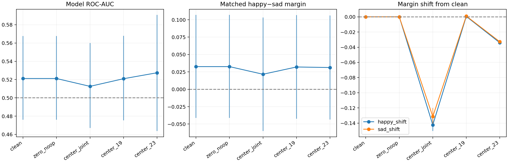

# 自然模型的 causal-edge mean correction

2026-09-15。把上轮外部probe的content-offset假设转为模型内部干预：在每层真正的post-o_proj decision update中加入无标签校准offset，再直接测模型的happy/sad margin。没有换donor、修改audio或训练模型。

## 实验

192条speech intensity01音频、96matched pairs、24actors；原prompt与单token ` happy`6247/` sad`12421。每个测试actor的校准均值只用其他23actors，每句话92样本，不使用emotion标签。已知statement身份，参考均值为两句话均值的平均。

`c_s,l = (mu_01,l + mu_02,l)/2 − mu_s,l`

在o_proj输出仅修改decision行：`output_decision += c_s,l`。这等价于修改其中的audio edge update而保留该位置的非audio贡献和共享bias。联合校正18–23为主实验；19、23单层为事先指定的次级条件。零校正为no-op控制。

校准来自固定clean vectors；联合干预中后续query及计算自然改变，不重新估计均值。因此不能声称每一层干预后的实际分布都被精确去均值。两个emotion收到相同actor/statement校正，所有输出差异都由冻结模型的后续计算产生。

## 结果

**主实验没有改善模型自己的emotion readout。** 联合校正后的AUC略降、两类margin共同更偏SAD；单层校正也没有可靠改善。

| 条件 | Accuracy | ROC-AUC | Matched H−S gap | Pair方向为正 | 平均分数平移 |
|---|---:|---:|---:|---:|---:|
| Clean | 50.0% | 0.5212 | +0.03258 | 48.96% | +0.00000 |
| Zero no-op | 50.0% | 0.5212 | +0.03258 | 48.96% | +0.00000 |
| 校正18–23 | 50.0% | 0.5126 | +0.02159 | 51.04% | -0.13683 |
| 只校正19 | 50.0% | 0.5209 | +0.03204 | 48.96% | +0.00078 |
| 只校正23 | 50.0% | 0.5275 | +0.03126 | 48.96% | -0.03348 |

全部5条件均为192/192 SAD，没有改善固定零阈值分类。联合校正的AUC变化为−0.00857，配对95% actor CI [−0.01617,−0.00033]；这是固定校准均值、多指标未校正下的小幅负向变化，不应扩展为所有content centering都会损害性能。

联合校正的matched gap从+0.03258降至+0.02159，变化−0.01099，CI [−0.02564,+0.00298]跨0；正向pair比例47/96→49/96，并非所有指标一致变差。Happy/Sad平均margin分别从−4.01424/−4.04682变为−4.15656/−4.17816，共同shift=−0.13683 [−0.14314,−0.13026]。主要可见变化是整体更偏SAD，未带来情绪分离提升。

只校正19的AUC变化−0.00022 [−0.00217,+0.00163]；只校正23变化+0.00629 [−0.01650,+0.02713]，均跨0。所有absolute AUC区间仍跨0.5。

### Statement内部读出

| 条件 | Statement01 AUC | Statement02 AUC | Statement01均值shift | Statement02均值shift |
|---|---:|---:|---:|---:|
| Clean | 0.5964 | 0.4514 | 0 | 0 |
| 校正18–23 | 0.5990 | 0.4262 | −0.22663 | −0.04702 |
| 只校正19 | 0.5959 | 0.4518 | −0.01079 | +0.01236 |
| 只校正23 | 0.5955 | 0.4488 | +0.18125 | −0.24821 |

这些为按statement的描述性结果，没有单独区间。Block23校正明显移动两句话各自的分数位置，但其内部AUC几乎不变，matched gap也基本保留；pooled AUC的小幅变化不能解释为情绪识别排序被可靠修复。

### 与上轮外部probe结果的关系

上轮block23的外部probe在独立actor校准后accuracy50.5%→60.4%，证明offset是那个固定分类器阈值失效的部分原因。本轮固定原模型的LM readout、参考两句话的中点，并让后续计算自然演化；没有把外部probe学到的方向或intercept装入模型。两种干预及读取方式不同，改善不必一致。

**当前结论：单纯消除这组clean edge的content-dependent common offset，不足以恢复模型自己的happy/sad读出。** 外部probe的阈值污染证据仍成立，但不能直接提升为“自然模型不用emotion主要就是这个offset造成”。本轮也未进一步区分全局词表偏置、后续非线性变换、动态均值漂移或其他表征因素。

## 结论边界

- 这是使用已知statement身份和其他actor的无标签目标statement数据进行校准；不是对未知文本的无监督泛化。两句话与平衡emotion比例是实验条件。
- Accuracy固定S>0预测happy；没有调输出bias、阈值或gain。模型原有强SAD偏置可能仍在。
- Pooled AUC或accuracy改变可能来自statement间分数偏移，需同时检查statement内AUC和matched-pair separation。
- Actor-bootstrap条件于固定校准均值，未在重采样中重估均值；次级条件和多指标区间未校正。
- 校正失败不能证明offset无关，成功也不等于完整解决emotion recognition。当前干预的分布变化及后续非线性计算仍影响解释。

## 证据与复现

- [运行前口径](./experiment-spec.md)、[完整复现](./reproduce.sh)
- [逐样本分数](./scores.csv)、[运行校验](./scores_run.json)、[校准样本数与shift范数](./calibration_norms.csv)
- [指标及CI](./analysis/summary.csv)、[配对变化](./analysis/contrasts.csv)、[逐pair效应](./analysis/pair_shifts.csv)、[statement内部指标](./analysis/statement_descriptives.csv)
- [统计口径](./analysis/analysis.json)、[历史复现验证](./analysis/verification.json)、[汇总验证](./verification.json)

校准均值NPZ保存本地与biggpu，不上传Git；代码、CSV、图表与复现元数据上传。

验证：远端72项测试通过；本地51通过、19因可选运行时依赖缺失跳过。全部960次候选likelihood一致性检查通过，历史clean、no-op及非decision行变化均精确为0；独立重算全部校准均值误差0。
