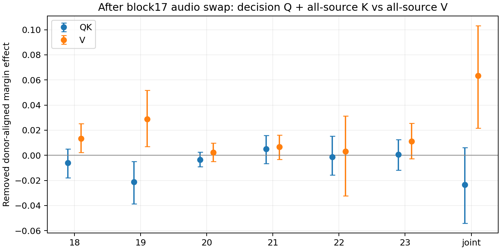
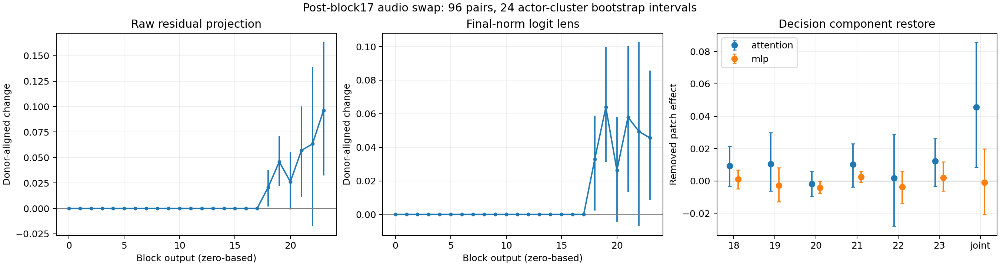

# Layer17 audio → decision：residual alignment 与 component restore

日期：2026-09-15。冻结 SLAM-Omni-0.5B；RAVDESS speech、intensity01、192 条音频、96 严格 matched pairs、24 actors。固定单 token ` happy`/` sad`（6247/12421）、同一 upper prompt、seed1234。层号从 0 开始。全部区间为 10,000 次 actor-cluster bootstrap 95% CI，seed20260915；逐层区间未做多重比较校正。

## 1. Patch 信号何时与输出方向对齐

在 block17 输出替换 audio span，decision position 不直接替换。令 d=W_happy−W_sad，对 happy target 的 patched−clean 投影取负，对 sad target 取正，再在 pair 内平均。下表测的是 **该干预引起的 donor-aligned change**，不是自然 emotion 首次出现的位置。Raw h·d 与 final RMSNorm(h)·d 分别报告，后者是 logit lens；只有最终层可等同实际模型 margin。

| Block 输出 | Raw residual Δ(h·d) | Final-norm logit lens Δ |
|---|---:|---:|
| 0–17 | 0（结构性检查） | 0（结构性检查） |
| 18 | +0.0207 [+0.0017, +0.0372] | +0.0329 [+0.0024, +0.0588] |
| 19 | +0.0458 [+0.0222, +0.0713] | +0.0638 [+0.0313, +0.0995] |
| 20 | +0.0261 [-0.0011, +0.0554] | +0.0263 [-0.0044, +0.0579] |
| 21 | +0.0569 [+0.0112, +0.1002] | +0.0579 [+0.0135, +0.1004] |
| 22 | +0.0633 [-0.0175, +0.1388] | +0.0493 [-0.0070, +0.1026] |
| 23 | +0.0963 [+0.0325, +0.1632] | +0.0456 [+0.0085, +0.0857] |

按逐层描述性区间，block18 输出已出现正向 alignment，block19 更明显；block20 回落，block21 回升。它不是单调积累，也不能由这些区间精确确定唯一“起始层”。自然 clean happy−sad 的 final-layer logit-lens difference 为 +0.0326 [−0.0413,+0.1068]，不能把 intervention alignment 写成自然分类已经可靠。

## 2. Attention vs MLP：条件恢复移除了多少效应

以同一 block17 audio swap 为共同起点，恢复 clean target 在 decision position 的 attention 或 MLP contribution，位置是 component 输出、residual addition 之前。M=CE_patch−CE_restore；正值表示移除 donor-aligned margin，负值表示恢复后效应增强。此操作不恢复 residual skip stream 或其他 token 的 component。

| 恢复位置 | Attention 移除量 M | MLP 移除量 M |
|---|---:|---:|
| 18 | +0.0093 [-0.0032, +0.0213] | +0.0012 [-0.0047, +0.0068] |
| 19 | +0.0105 [-0.0062, +0.0297] | -0.0028 [-0.0127, +0.0081] |
| 20 | -0.0018 [-0.0097, +0.0058] | -0.0040 [-0.0079, -0.0002] |
| 21 | +0.0102 [-0.0037, +0.0230] | +0.0026 [-0.0009, +0.0059] |
| 22 | +0.0018 [-0.0279, +0.0289] | -0.0036 [-0.0137, +0.0059] |
| 23 | +0.0122 [-0.0033, +0.0261] | +0.0021 [-0.0063, +0.0118] |
| joint | +0.0456 [+0.0085, +0.0857] | -0.0010 [-0.0206, +0.0198] |

原始 patch CE=+0.04555。Joint attention restore 后 CE=0；joint MLP restore 后 CE=+0.04652。两种移除量的直接配对差值为 **+0.04652 [+0.01650,+0.07696]**，通过运行前指定的 QK/V 门槛。

这里的 joint attention 完全恢复 clean margin 有结构性原因：decision 起点未改，后续每层 attention contribution 均恢复 clean 后，逐 token MLP 也走 clean decision 轨迹。因此它是重要 sanity check，但不证明某个独特 block。所有逐 block attention 移除量的 CI 均跨 0，尚未定位单独必要的 mediator block。MLP20 的负向区间属于未校正的探索性结果，不能据此宣布确定的 suppression block。这些结果限于 decision position，不能排除 audio positions 上的 MLP 作用。

## 3. QK / V 分离

前两阶段通过门槛后，在同一 block17 audio patch 背景下，分别恢复 clean target 的 decision Q + 全部 prefix K，或全部 prefix V。保持 SDPA 后端，不需要提取 attention weights 或更换 eager。投影替换在 RoPE 前，位置不变，无 KV cache。主比较是 blocks18–23 联合恢复；逐 block 仅探索。

| 恢复条件 | 剩余 CE | 移除量 M |
|---|---:|---:|
| qk_joint | +0.0691 [+0.0249, +0.1109] | -0.0236 [-0.0540, +0.0060] |
| v_joint | -0.0180 [-0.0484, +0.0113] | +0.0635 [+0.0217, +0.1033] |
| qkv_joint | +0.0000 [+0.0000, +0.0000] | +0.0456 [+0.0085, +0.0857] |

**V−QK 移除量的配对差值为 +0.08706 [+0.02541,+0.14693]。** 在本轮 all-source 条件干预下，证据更支持 altered value content 承载正向 margin effect，而不是 QK routing 变化主导这个效应。QK restore 的移除量均值为负、CI 跨 0，不能宣称 QK 有确定的抑制作用，也不能宣称自然 routing 无用。

探索性逐 block 扫描中，V18 移除量为 +0.0134 [+0.0022,+0.0251]，V19 为 +0.0289 [+0.0069,+0.0518]；QK19 为 −0.0212 [−0.0385,−0.0049]。这给出 block18–19 value 路径的候选线索，但区间未做多重比较校正，且分离干预存在交互，不能宣布唯一 mediator 或简单相加。

同时恢复 QKV 精确回到 clean margin，与 joint attention restore 一致，closure 最大误差为 0。V 移除量大于原始 CE，且恢复后剩余 CE 略为负但 CI 跨 0；这不意味着“解释了超过 100% 的独立中介”，因为 QK/V 和跨层干预存在交互，恢复效应不能按比例相加。

结论限于 **全部 prefix 来源** 的 K/V，包含 audio、prompt 等 positions。它没有隔离 audio-only V，也没有定位唯一 head 或 block。仍需区分“当前 patch effect 的 value dependence”和自然 emotion-specific computation；本轮不把前者升级为后者。

- [QK/V 逐样本结果](./qkv_effects.csv)、[运行元数据](./qkv_effects_run.json)
- [QK/V 汇总](./qkv_analysis/component_summary.csv)、[直接配对 contrasts](./qkv_analysis/component_contrasts.csv)

## 验证

- 前两阶段 2,688 行（192×14），第三阶段 5,568 行（192×29），每次各 4,608 行 attribution；完整覆盖 96 pairs。
- 第三阶段重复的 14 个 attention/MLP 条件与前两阶段逐样本精确一致。与旧单 token patch 的 pair CE 最大差 6.91×10⁻⁶。
- 全部 192 样本 clean/patch prefix-only scorer 与原 teacher-forced scorer 最大差分别为 1.53×10⁻⁵ / 1.43×10⁻⁵；final logit-lens 误差 ≤3.58×10⁻⁶。
- 首样本各恢复条件的 self restore、self audio patch、所有样本 block0–17 decision 投影变化均为 0。全量 joint attention 和 joint QKV restore 精确回到 clean margin。
- Clean 与原始 audio patch 后均为 192/192 sad prediction，分类仍为 50%；小幅 donor-aligned margin change 没有跨过标签边界。
- 远端 23/23 测试通过；本地 19 passed、2 skipped（无 torch）。Python 语法编译、shell 语法和 diff whitespace 检查通过。没有额外配置的 lint/typecheck 工具。

## 证据与复现

- [实验口径与条件门槛](./experiment-spec.md)
- [逐样本 component restore](./effects.csv)、[逐层 attribution](./effects_attribution.csv)
- [component 汇总](./analysis/component_summary.csv)、[直接配对 contrasts](./analysis/component_contrasts.csv)、[residual 汇总](./analysis/residual_summary.csv)
- [主门槛结果](./analysis/attention_gate.json)、[运行元数据](./effects_run.json)、[跨轮验证](./verification.json)
- [复现命令](./reproduce.sh)

模型权重 SHA-256：`601055c1d7022f076a29f1c22693aa6038083631f54e51204f3099a4ec37249e`，与上一轮一致。torch2.5.1、transformers4.57.6；参数冻结，无训练、无新依赖。

解释边界：本轮是固定 checkpoint、单 prompt/verbalizer、单 seed 的条件状态干预。移除量不是可加的自然中介比例，不能把小 margin shift 等同于可用分类能力。旧 head transplant 不是以 layer17 audio intervention 为条件的路径中介；旧 donor-control 的“一个显著、另一个不显著”也不建立 emotion specificity。本轮不沿用这些过强表述。
