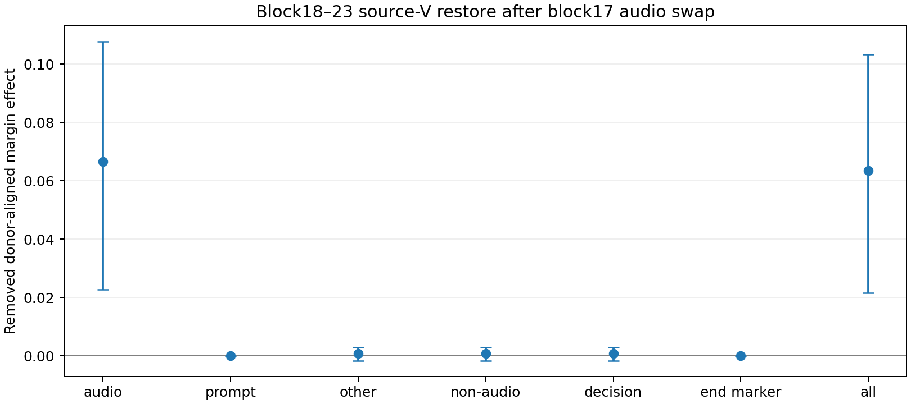

# Source-specific V restore：效应主要依赖 audio-position values

2026-09-15。冻结 SLAM-Omni-0.5B；RAVDESS speech intensity01、192样本、96严格happy/sad matched pairs、24 actors。保持 post-block17 audio donor swap、blocks18–23 joint V restore、单 token ` happy`/` sad`（6247/12421）、seed1234，与上一轮一致。全部范围按零起点。

**主要结果：audio-only restore 移除 +0.06653，all-V 移除 +0.06351；非audio恢复的移除量很小。当前 margin effect 主要依赖 audio positions 的 altered values。** 这是 source-specific、all-query 干预结论，不能仅据此声称 audio→decision 的直接边已被隔离证明。

## 来源范围与定义

| 来源 | 位置 | 解释 |
|---|---|---|
| audio | [29,329) | 300个projected audio positions |
| prompt | [0,28) | 前置prompt及其wrapper |
| other | {28,329,330} | 音频输入标记、结束标记、decision |
| non-audio | [0,29) ∪ {329,330} | prompt与other的并集 |
| decision | {330} | answer_a/answer_t位置 |
| end marker | {329} | eoa/eot位置 |
| all | [0,331) | 全部prefix |

Audio/prompt/other互斥完备；non-audio与prompt/other重叠，不能作为第四块相加。前置prompt和位置28在causal mask下看不到后来的audio，因此无法承接此次post17 audio干预；prompt-only为结构性零效应。

令 S=logP(happy)−logP(sad)，M_source=donor_sign×(S_patch−S_restore)，happy target取−1、sad target取+1，再在pair内平均。M>0表示恢复clean来源V后移除了正向donor margin。原始patch CE=+0.04555，M不是分类准确率或可加的中介百分比。

## 结果

下表为M，区间为10,000次actor-cluster bootstrap 95% CI（numpy seed20260915）。重点描述Audio−all的配对差值；所有区间均未做多重比较校正。

| V恢复来源 | 移除量M | 95% actor CI |
|---|---:|---:|
| audio-only | +0.066528 | [+0.022835, +0.107767] |
| prompt-only | +0.000000 | [+0.000000, +0.000000] |
| other（不含prompt的非audio） | +0.000788 | [-0.001604, +0.002886] |
| 全部non-audio | +0.000788 | [-0.001604, +0.002886] |
| decision-only | +0.000787 | [-0.001596, +0.002874] |
| 音频结束标记 | +0.000001 | [-0.000027, +0.000030] |
| all-V | +0.063510 | [+0.021657, +0.103252] |

- **Audio−all：+0.003018 [+0.000016,+0.005939]。** Audio与all的移除量处于相同量级，但audio均值略大；差值CI下界非常接近0，不据此强调稳健优越性，也不能写成完全相等；没有预先指定实质等价界，因此不宣称正式等价。
- **Audio−non-audio：+0.065740 [+0.021715,+0.106847]。** 直接配对差异支持audio来源的移除量更大，而不只是“audio显著、non-audio不显著”。
- Other与non-audio的逐样本分数精确一致。Other−decision只有约+0.000001，CI跨0；结束标记效应均值约1.5×10⁻⁶。未看到大的后置非audio V中介效应。
- **All−(audio+prompt+other)：−0.003806 [−0.006490,−0.001107]。** 恢复效应非加性；audio-only略大于all不表示“解释了超过100%”的独立路径。恢复改变后续计算，来源之间可产生交互。

## 能支持什么，尚不能支持什么

证据支持：在此冻结模型、固定prompt/verbalizer与joint restore背景下，layer17 audio swap引起的logit-relevant margin变化主要依赖**audio-position values**，没有得到“主要由非audio values转运”的正向证据。音频结束标记与decision-only V恢复的效应很小。

这不等同于直接传递已经被证明。V投影的source替换作用于**所有query**：恢复audio V既改变decision对audio的读取，也可能阻断audio→结束标记或其他位置的首次写入。非audio V的小效应也不排除经Q/K或其他非线性路径的间接影响。本轮没有运行query/edge-specific restore，不能严格区分audio→decision直达与所有可能的multi-hop路径，也不能证明自然emotion-specific利用。无训练、无权重修改。

## 验证与复现

- 完整1,344行（192×7），96pairs；同一sample的clean/patched基线在所有条件精确一致。
- 新all-V与上一轮all-V的clean、patched、restored逐样本分数最大差为**0**。
- Prompt restore无效应、other与non-audio一致、前置prompt及输入标记V不变，最大误差均为**0**。
- 首样本7条件self restore和self audio patch误差均为0。全部192样本clean/patched prefix-only scorer与原teacher-forced scorer最大差分别1.53×10⁻⁵和1.43×10⁻⁵。
- 远端29/29测试通过；本地23 passed、4 skipped（缺torch）；Python编译、shell语法与diff检查通过。运行后端SDPA，float32；torch2.5.1、transformers4.57.6。
- 复用既有推理与配对统计工具；新增来源选择hook、分析和测试，无新依赖。没有训练或修改checkpoint。

[运行前口径](./experiment-spec.md) · [原始逐样本结果](./effects.csv) · [运行元数据及source范围](./effects_run.json) · [汇总](./analysis/source_summary.csv) · [配对差值](./analysis/source_contrasts.csv) · [验证](./verification.json) · [复现命令](./reproduce.sh)
