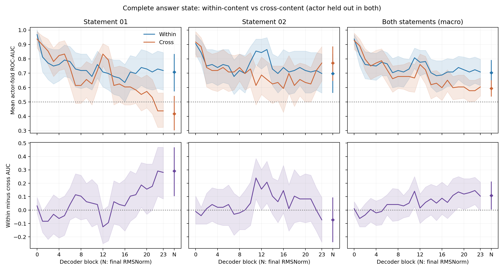

# Answer state：句内线性可读性下降，还是跨文本泛化失败？

2026-09-16。直接复用Module B的完整answer states；新增within-statement probe，cross分数复用Module B joint-held-out。本轮无模型forward、干预或训练插件。

## 统一曲线与gap

[PDF](./within_cross_content.pdf)。三列按**测试statement**区分：01、02、两句等权平均。上排蓝线within-content、橙线cross-content；下排为配对差值G。横轴0–23为完整post-block residual，N是独立final RMSNorm端点。阴影/误差线为10,000次配对actor-bootstrap的点态95%区间，条件于固定拟合的probe，未重拟合、未校正跨层比较。

这里的主指标是**相同held-out actor × statement测试折内AUC的平均值**。每句话平均24个actor-fold，两句话再等权平均；G两边使用同一聚合口径。因此主图的最终cross AUC约0.594，而不是先前pooled OOF AUC约0.54。完整pooled指标与accuracy另存，不能拿两种AUC相减。

## 结果：同时有句内下降和不对称的跨文本损失

**晚期answer的情绪并未变得完全不可线性读取，但句内可读性也明显弱于早期；此外，跨文本泛化损失主要出现在02→01方向。** 这不支持“句内始终保持很强的信息，只是两句话的方向不同”这一纯粹版本，也不能说所有情绪信息都消失。

| 完整answer位置 | Within-content AUC | Cross-content AUC | G及配对95%CI |
|---|---:|---:|---:|
| Block0 | 0.9375 | 0.9271 | +0.0104 [−0.0313, 0.0625] |
| Block6 | 0.7656 | 0.7240 | +0.0417 [−0.0365, 0.1146] |
| Block23 | 0.7083 | 0.6042 | +0.1042 [−0.0052, 0.2083] |
| Final RMSNorm（N） | 0.7031 | 0.5938 | +0.1094 [0.0052, 0.2135] |

句内AUC从block0的0.9375下降到block23的0.7083，期间有波动，不能把全部跨句下降归因于content mismatch。最终归一化后，句内AUC仍为0.7031 [0.6094,0.7917]，说明此协议下仍有中等强度的可读信号；这里的“下降”是线性probe表现变化，不是信息论意义的信息消失。

两句话的差异尤其重要。Block23：

- **测试statement01**：within训练01，cross训练02；AUC为0.7188 vs0.4375，G=+0.2813 [0.0833,0.4688]。
- **测试statement02**：within训练02，cross训练01；AUC为0.6979 vs0.7708，G=−0.0729 [−0.2396,0.0938]。这一方向没有句内读出的优势；负点估计也不足以证明cross优于within。

所以不能把合并曲线解释为两句话共同、对称地发生了emotion-direction旋转。Block23合并gap的区间跨零；N端点仅在未校正的点态区间中下界略高于零。N不是用来替换block23以追求显著性的“最佳层”，全部层均已报告。每个测试fold只有4条音频，单折AUC很离散；两句/24actors的规模限制了泛化与层间比较。

一个有用的界限是：给某个statement的所有分数加同一常数，不会改变其折内AUC。因此statement01的句内/跨句排序差不能**仅**用类别阈值平移解释。但本实验仍未直接比较方向，无法从中证明向量旋转；协方差、有限样本拟合及其他表示变化也可能影响迁移。

作为同口径补充，N的combined **pooled** AUC为0.7000 vs0.5395，pooled gap=0.1605 [0.0578,0.2605]；accuracy为67.2% vs50.5%。Pooled分数跨不同拟合模型，受fold/statement间尺度和偏移影响，不能用这个更大的gap替代主图的折内gap。

## 严格匹配的协议

对每个测试actor及statement，within训练其他23actors的同一句话，cross使用其他23actors的另一句话。两边均为92条训练样本，测试完全相同的4条样本（happy/sad各2条）。不使用测试actor训练；不把Module B混合两句话的speaker probe当作within-statement结果，也不拿未排除测试actor的statement-only split作主要cross对照。

与Module A/B相同：train-only StandardScaler、C=1 logistic regression、lbfgs/max_iter5000、happy=1、seed20260915，无调参。对24层及独立N端点进行1,200个within拟合；cross全部复用原有分数。不同statement和条件共用同一批actor重采样，直接bootstrap差值，保留actor的两句话和所有repetitions；不是两条CI端点相减。

## 证据与验证

- [全部层/statement指标与CI](./summary.csv)、[逐fold结果](./fold_metrics.csv)、[两种条件OOF分数](./oof_predictions.csv)、[完整训练/测试成员](./fold_membership.csv)
- [来源hash与协议](./analysis.json)、[预先固定的实验口径](./experiment-spec.md)、[复现命令](./reproduce.sh)、[验证记录](./verification.json)

新增`analyze_answer_content.py`及针对性测试，复用原有fold、AUC和Module B输入验证；没有新增依赖或模型修改。25种表示×2条件×192条样本共有9,600条唯一OOF记录；复用cross的所有combined指标与Module B完全一致。来源向量SHA256为`c4bd68851b6598db8edc4fd831a693e1a131b9548817b1242503678fc74c1097`。

远端90项测试通过；本地65项通过、23项因可选运行时依赖缺失跳过。数值与机制措辞保持区分：本轮识别的是句内可读性下降与方向不对称的泛化损失，尚未证明造成它们的具体decoder计算。
