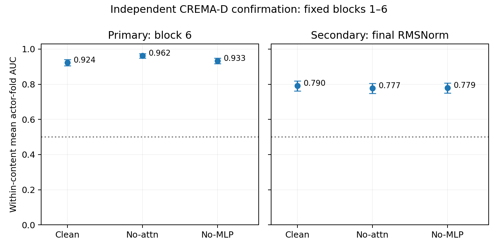

# CREMA-D 独立数据确认：早期 answer-position Attention 更新

2026-09-16。**预定主效应在 CREMA-D 的固定样本上复现，但效应更小，且未观察到最终回答状态改善的证据。** 本轮只回答：原来在 RAVDESS 发现的 blocks 1–6 answer-position Attention 干预效应，是否能在另一批语料演员和更多句子上出现。

RAVDESS 用于发现现象、选择分析对象和窗口；上一轮虽固定了干预条件，仍属于同一发现数据上的因果确认。本轮采用独立语料，且在任何 CREMA-D 模型结果产生前，将[协议与 manifest](./experiment-spec.md)提交为 [6ec6df5](https://github.com/YB123-DT/audio_llm/commit/6ec6df5)，实现随后提交为 [1be6d4f](https://github.com/YB123-DT/audio_llm/commit/1be6d4f)。没有根据新结果重新选择层、演员、句子、强度、prompt 或 probe 超参数。

## 统一结果

主指标是 **within-statement mean actor-fold AUC**，不是 pooled AUC 或原模型分类准确率。表中括号为配对 actor-cluster bootstrap 的 95% 区间。

| 条件 | 主终点：block6 W | 次终点：final RMSNorm answer W |
|---|---:|---:|
| clean | 0.9236 [0.9050, 0.9411] | 0.7903 [0.7614, 0.8182] |
| no_attn | 0.9618 [0.9483, 0.9742] | 0.7769 [0.7479, 0.8058] |
| no_mlp | 0.9329 [0.9163, 0.9494] | 0.7789 [0.7500, 0.8079] |

| 对比 | block6 差值 [95% CI] |
|---|---:|
| delta_A | 0.0382 [0.0207, 0.0558] |
| delta_A_minus_M | 0.0289 [0.0124, 0.0455] |
| delta_M_secondary | 0.0093 [-0.0031, 0.0217] |

ΔA = no_attn−clean，ΔA−M = no_attn−no_mlp。两个预定主对比均为正，且配对区间下界均高于零，满足事前冻结的合取判据。相较 clean，no-attn 提高约 **3.82 个 AUC 百分点**；相较 no-MLP 提高约 **2.89 个百分点**。no-MLP−clean 为次要对比，其区间跨零。

[PDF 图](./analysis/crema_confirmation.pdf)。误差线为各条件区间；两个主判断使用直接配对差值的区间，不通过独立误差线是否重叠来判断。

作为发现阶段参考，RAVDESS 的 clean/no-attn/no-MLP 为 0.7656/0.9219/0.7552，ΔA 为 +0.1563；CREMA-D 的 clean 基线更高，ΔA 为 +0.0382。**新数据支持相同干预效应的方向，不支持把 RAVDESS 的大幅下降或恢复幅度当作跨数据集常数。** 这不是控制其他因素后的跨数据集效应量比较；强度编码、录音域、标签和训练样本量均不同，也不能仅凭高基线就认定较小效应由 ceiling 导致。

## 句子差异与最终状态

保留全部 11 句话的描述性结果，不筛选有利子集。ΔA 的点估计为 7 句正、2 句零、2 句负，因此结论是对固定 11 句的平均效应；不是每一句都改善。下表子组区间未作多重比较校正。

| Statement | clean W6 | no-attn W6 | no-MLP W6 | ΔA [95% CI] |
|---|---:|---:|---:|---:|
| DFA | 0.9886 | 0.9773 | 0.9886 | -0.0114 [-0.0568, 0.0227] |
| IOM | 0.9545 | 0.9545 | 0.9432 | 0.0000 [-0.0455, 0.0455] |
| ITH | 0.9091 | 0.9773 | 0.9659 | 0.0682 [0.0227, 0.1250] |
| ITS | 0.9318 | 1.0000 | 0.9318 | 0.0682 [0.0227, 0.1250] |
| IWL | 0.8182 | 0.9432 | 0.8636 | 0.1250 [0.0341, 0.2159] |
| IWW | 0.9545 | 1.0000 | 0.9659 | 0.0455 [0.0114, 0.0909] |
| MTI | 0.9318 | 0.9545 | 0.9432 | 0.0227 [-0.0341, 0.0909] |
| TAI | 0.8977 | 0.9659 | 0.8636 | 0.0682 [0.0114, 0.1364] |
| TIE | 0.8750 | 0.8750 | 0.8977 | 0.0000 [-0.0909, 0.0909] |
| TSI | 0.9886 | 0.9773 | 0.9773 | -0.0114 [-0.0568, 0.0227] |
| WSI | 0.9091 | 0.9545 | 0.9205 | 0.0455 [-0.0227, 0.1136] |

最终完整 answer state 的 no-attn−clean 为 **−0.0134 [−0.0331, 0.0052]**，no-attn−no-MLP 为 **−0.0021 [−0.0227, 0.0186]**。点估计没有改善，区间均跨零；不能由此断言稳定损害，也不能声称早期局部可读性的提升会持续到最终状态。没有检验原模型 LM head 的干预后分类或生成改善。

## 数据与固定协议

[官方 CREMA-D](https://github.com/CheyneyComputerScience/CREMA-D)有 91 位演员、12 句话。按照文件元数据，仅纳入 HAP/SAD、强度代码 XX 的全部 11 句；IEO 使用其他强度代码，不混入本轮。XX 的含义是**强度未指定**，不是与 RAVDESS intensity01 等价的受控强度。

只保留全部 11 句 happy/sad 文件完整的演员：排除 1008（缺 WSI）、1009（缺 MTI）、1019（缺 ITH），得到 **88 actors × 11 statements × 2 emotions = 1,936 条音频、968 对**。这些选择只依据文件完整性，先于模型输出。标签使用原始 intended emotion，不按 crowd ratings 重标或筛选。每格只有一条音频，manifest 的 repetition01 只是兼容字段，不表示实际存在重复录制。

- 模型、prompt、float32 运行环境、音频预处理与发现阶段相同；模型冻结，无插件或模型训练。
- 固定零起始 blocks 1–6，仅在 residual add 前抑制指定组件的 answer 行。保留的组件按当前状态正常重算；block0 和其他 token 不干预。
- 同句内留一 actor：训练其余 87 actors 的 174 条音频，测试 held-out actor 的一对 happy/sad。每个条件、终点重新拟合 train-only StandardScaler + C=1/ lbfgs/ max_iter5000 logistic probe，happy=1，seed20260915。没有混用或复用 RAVDESS probe 分数。
- 单折只有两条音频，AUC 取 0、0.5 或 1；对 88 actors 和 11 句等权平均。共 968 折 × 3 条件 × 2 终点 = 5,808 次拟合。
- 10,000 次共享配对 actor-bootstrap，保留 actor 的全部句子；区间条件于固定 11 句和已拟合 probe，不重拟合 probe，也不重采样句子。不是任意新句子的总体泛化区间。

这是新语料上的 actor-held-out、within-content 解码，不是把 RAVDESS 分类器直接迁移，也不是训练时未见该 statement 的 classifier transfer。另一数据集提供了独立验证样本，但真实人员跨语料是否重合、模型预训练是否见过这些数据，无法据现有资料独立排除；同一 checkpoint 的结果也不能推广到其他模型。

## 验证、交付与停止

全部 1,936 个 WAV 均通过解码和 SHA256 校验，内容哈希无重复，本地与 biggpu 一致。三条件共 5,808 次 decoder forward，另有一次 unhooked clean 验证；**92,928 次非 answer 逐层比较 bitwise 相同，23,232 次指定 update 抑制检查通过，clean/unhooked 差为 0**。

所有 11,616 条 OOF 记录完整且唯一。独立核对从每个 happy/sad 测试对直接重算 fold AUC，再按 actor 重采样，复现全部 72 个 AUC 汇总和 72 个配对对比区间；170,368 条 fold membership 验证无 actor 泄漏。远端完整测试 127 项通过；本地 97 项通过、27 项因可选运行时依赖缺失跳过；语法与复现脚本检查通过。

- [冻结样本](./manifest.csv)、[选择记录](./selection.json)、[音频校验](./audio_checksums.csv)
- [主次终点](./analysis/summary.csv)、[配对差值](./analysis/contrasts.csv)、[OOF 分数](./analysis/oof_predictions.csv)、[逐折指标](./analysis/fold_metrics.csv)、[划分](./analysis/fold_membership.csv)
- [提取来源](./intervention_states.json)、[分析来源](./analysis/analysis.json)、[独立验证记录](./verification.json)、[复现命令](./reproduce.sh)

新增数据准备、独立提取与分析脚本及对应测试；复用原干预 hooks、probe 和统计函数，无新依赖。向量和音频保留本地及 biggpu，不上传权重或音频至 Git。

**判断：早期 answer-position Attention 更新对 block6 情绪线性可读性的影响，在这批独立语料样本上得到复现；效应幅度和逐句表现有限，未观察到最终状态改善证据。** 不能归因为 lexical semantics suppress emotion，也没有证明原模型的情绪判断得到修复。按固定终点结束本轮，不追加窗口、路径或修复搜索。
