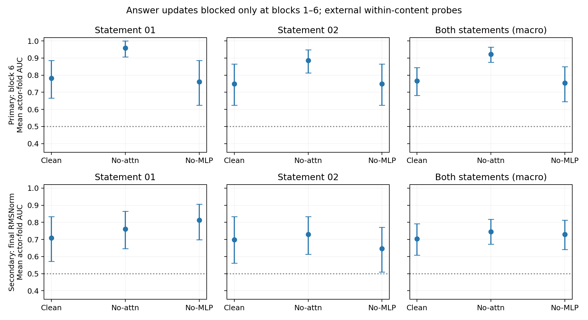

# 最后一次固定因果确认：阻断早期answer-position更新

2026-09-16。仅运行clean、no-attn、no-MLP三个预定条件；仅在零起始编号的blocks1–6阻断answer位置的对应residual update，block0及其他位置保持正常。主终点预定为block6的within-content mean actor-fold AUC；最终RMSNorm回答状态为次终点。

## 主结果

**阻断早期answer-position Attention update将block6的线性可读性从0.7656提高到0.9219，而阻断MLP得到0.7552。** 两个预定主对比的配对actor-bootstrap区间均高于零。因此，在这项限定干预和probe协议下，结果支持：**early answer-position Attention updates causally contribute to the loss of linearly decodable emotion structure**。

| 条件 | 主终点：block6 W [95%CI] | 次终点：final answer W [95%CI] |
|---|---:|---:|
| clean | 0.7656 [0.6823, 0.8438] | 0.7031 [0.6094, 0.7917] |
| no-attn | **0.9219 [0.8750, 0.9635]** | 0.7448 [0.6719, 0.8177] |
| no-MLP | 0.7552 [0.6457, 0.8490] | 0.7292 [0.6406, 0.8125] |

| 预定主对比 | block6配对差值 | 配对95%CI |
|---|---:|---:|
| ΔA = no-attn − clean | **+0.1563** | **[0.0729, 0.2448]** |
| ΔA−M = no-attn − no-MLP | **+0.1667** | **[0.0677, 0.2865]** |

次要对比no-MLP−clean为−0.0104 [−0.0781,0.0521]。这里没有为no-attn选择更有利的窗口、gain、prompt或probe超参数；三个条件、blocks1–6与block6终点均在结果前固定。

[PDF](./analysis/early_answer_causal.pdf)。上排为主终点，下排为次终点；列按测试statement01、02、两句等权平均区分。误差线是10,000次actor-cluster bootstrap的95%区间，条件于已拟合probe，不重拟合；预定对比与statement子组区间均未作多重比较校正。差值区间来自每次重采样中的配对差，不是图中独立误差线端点相减。

## 两句话与最终状态的边界

Block6的两个statement点估计均改善：statement01为0.7813→0.9583，statement02为0.7500→0.8854。Statement01的ΔA为+0.1771 [0.0833,0.2917]，statement02为+0.1354 [0,0.2813]；后者区间下界触及零，不能声称两个子组都独立通过同样强的统计确认。主判断基于预定的两句合并终点。

最终完整answer状态的no-attn−clean仅为+0.0417 [0,0.0885]，no-attn−no-MLP为+0.0156 [−0.0260,0.0573]。因此，**局部block6的明显可读性恢复没有构成可靠的最终状态修复证据**。更没有测得或证明原模型LM head分类、指令遵循或生成表现改善；表中的W始终是外部linear probe AUC。

本实验不区分attention中的audio、prompt、task等source，不能写成“lexical semantics suppress emotion”。干预改变了后续answer计算，其状态也可能偏离自然运行分布；支持的是指定阻断对该线性可读性终点的因果作用，而非情绪信息被不可逆删除、某个source已被定位，或通用修复方案成立。

## 干预的精确定义与不变量

- no-attn：正常计算self-attention，在其输出经过o_proj之后、residual add之前，仅把answer行置零。MLP继续基于更新后的实际residual正常计算。
- no-MLP：正常计算attention与MLP，在MLP输出写入residual之前，仅把answer行置零。
- 每个干预仅注册于blocks1,2,3,4,5,6；不是冻结answer residual，不是关闭整个block，不修改其他token或模型权重。

沿用同样192音频、24actors、intensity01、原prompt与seed1234。每条音频准备一次相同prefix，运行三个decoder条件，共576次decoder forward。Answer位置330，300个audio tokens在29–328；answer是最后一个因果token。逐层核验两种干预下**所有330个非answer位置**与clean bitwise相同：共9,216次block比较，覆盖全部24层。2,304次指定update抑制调用全部验证target block、answer输出为零、其他update行不变，执行完毕移除hooks。

Clean的block6向量、最终RMSNorm向量和native margin与Module B最大差均为0。测试还通过手工forward对照，确认保留组件按受干预后的状态重新计算，未错误冻结或复制clean answer。

## Probe与复用协议

每个条件、每个终点独立拟合外部probe。对于测试actor/statement，训练其他23actors的同一句话（92条），测试该actor同一句话的4条音频；每折happy/sad平衡。Train-only StandardScaler、C=1 logistic regression、lbfgs/max_iter5000、happy=1、seed20260915，无调参。主AUC是每个actor×statement折内AUC的平均值，再对两句等权平均；不能与pooled OOF AUC互换。

在精确向量/来源/版本核验后复用96个clean probe，新增192个干预probe。所有条件和终点共用10,000次actor重采样，保持actor的两句话和全部repetitions；不将样本当作独立bootstrap单位。没有额外cross-content、native分类或新的observational逐层分析。

## 交付、验证与停止

- [主次终点与CI](./analysis/summary.csv)、[配对对比](./analysis/contrasts.csv)、[OOF分数](./analysis/oof_predictions.csv)、[逐fold结果](./analysis/fold_metrics.csv)、[相同划分](./analysis/fold_membership.csv)
- [干预与逐层不变量](./intervention_states.json)、[分析来源与协议](./analysis/analysis.json)、[预先固定的口径](./experiment-spec.md)、[复现命令](./reproduce.sh)、[验证记录](./verification.json)

新增干预/分析脚本及对应测试，复用现有输入、probe和统计工具，无新依赖。向量文件保留本地及biggpu，不上传Git。远端115项测试通过；本地85通过、27项因可选运行时依赖缺失跳过。两个终点×三个条件×192条样本共1,152条唯一OOF记录；clean结果精确复现此前对应终点。

**按约定在此停止实验。** 不追加层窗口、source/head分析、校准或插件；本轮交付主终点的因果支持，同时保留最终状态修复的不确定性。
