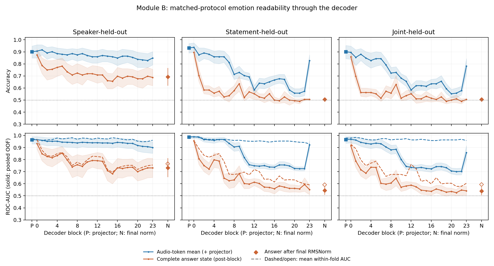

# Module B：emotion 可读性在 decoder 中如何变化？

2026-09-16。本轮只比较同一冻结 forward 的 audio positions 和**完整 answer position**，不追加 patch、校准、路径搜索或插件训练。

## 一张统一曲线

[PDF](./analysis/decoder_readability.pdf)。三列依次为 speaker、statement、joint held-out；上排 accuracy，下排 AUC。蓝色为 audio-token mean，橙色为完整 answer state。P 是 decoder 前的 Projector；0–23 是各完整 block 输出、最终 RMSNorm 前的 residual；N 单独表示最终 RMSNorm 后的回答状态，不是第25个 block。AUC 面板实线为 pooled OOF AUC，虚线为平均 within-fold AUC。阴影为实线指标的10,000次 actor-cluster bootstrap 95%区间，条件于已拟合探针、未重拟合、未校正多层比较。

## 一个判断

**结果更接近：情绪信息很早就已在回答位置可读，但其跨文本线性可读性随后分阶段减弱；audio positions 中仍持续保留较强的情绪排序信息。** 不是一进入 Qwen 就全部丢失，也不是从未到达回答位置。这个判断描述可读性轨迹，不能单独证明信息被删除或某个 routing/readout 组件失效。

- **回答位置早期已有强信号。** Joint pooled AUC：Projector为0.9667；block0 audio为0.9686，完整answer为0.9154（accuracy85.9%）。因此“信息一直只在audio、从未形成answer表示”不符合当前观察。
- **回答状态呈分阶段、非单调衰减。** Joint answer pooled AUC从block0的0.9154，到block1的0.7885、block6的0.6033、block14的0.5470，block23为0.5412，最终归一化后0.5395；最终accuracy50.5%。中间有反弹，不把它解释成严格逐层单调下降，也不从这张图指定唯一故障层或统计变化点。对应within-fold AUC从block0的0.9271降至block6的0.7240、block23的0.6042，故总体减弱并不只是pooled分数尺度的现象。
- **Audio排序信息更持久，但固定读出的跨文本分数不稳定。** Joint audio pooled AUC从block0的0.9686降到block21的0.7006，block23又回升到0.8588；其平均within-fold AUC在全部24层保持0.9583–0.9844。Statement-held-out的audio within-fold AUC也保持0.9299–0.9896。不能把pooled中后期下降直接写成audio emotion信息消失：不同fold训练的分数存在offset/scale差异，pooled AUC与固定阈值accuracy受此影响。这里没有进行任何校准来进一步归因。

尤其是audio block22→23的pooled回升，不能称为情绪排序能力恢复：joint within-fold AUC反而从0.9688略降至0.9583，statement从0.9425降至0.9299。

Speaker-held-out也显示audio比answer更稳定：block23 pooled AUC分别0.9002与0.7312；跨文本的answer结果更弱。三类划分均保留全部层的结果，没有挑选最好层。两个statement、24actors与高维小样本探针限制了泛化范围。完整answer是最后一个prompt token的状态，尚未生成候选答案token，不是候选token的二次计算。

## 与 Module A 完全相同的评价协议

192条speech音频、96个严格happy/sad配对、intensity01、24actors；happy=1。Speaker leave-one-actor-out；statement双向训练/测试；joint训练同时排除测试actor与测试statement。所有表示复用同一fold membership，训练集内拟合StandardScaler，再拟合C=1、lbfgs、max_iter5000的logistic probe；不调参、不训练原模型。每个对象/划分的192条样本各有一次OOF预测。

保存accuracy、pooled ROC-AUC、平均within-fold AUC及逐fold结果。不能把小测试fold的within-fold排序能力等同于可直接部署的统一分类阈值；也不能反过来把跨fold pooled分数差异全当作表示退化。当前模型的任务/标签接口仍受[Module A文字控制](../2026-09-16-module-a/report.md)所述限制，本轮没有补新的接口实验。

## 缓存、提取与端点核验

旧逐层回答缓存曾无法复现当前分数，故本轮补192条冻结clean提取，每条一次decoder forward，在同一次计算中保存全部24层两个位置。模型seed1234、原分类prompt、单token候选` happy`6247/` sad`12421保持不变。实际Projector输出在多流输入组合前单独捕获；audio span为位置29–328，共300token；answer位置330，prefix长度331。向量均为896维，不保存完整token矩阵到CSV。

- 全部192条Projector向量及native margins与Module A精确一致；Projector所有评价指标及CI也一致。
- 新block23原始answer与Module A来源的完整pre-norm缓存逐元素相同；经实际模型RMSNorm后与本轮最终answer精确一致。
- Module A在CPU重建的final RMSNorm与本轮实际GPU输出存在最大3.05176e−5的向量差。我们保留新提取值，没有替换旧端点来强行复现。最终accuracy在全部划分完全一致；speaker/joint pooled AUC变化分别+0.000326/+0.000217，statement指标不变；joint平均within-fold AUC从0.598958变为0.593750。所有21项最终answer指标/CI差异逐项记录，未选择事后容差掩盖差异。
- 本轮最终answer乘LM方向与native margin最大误差2.62e−6；沿用兼容性检查，未归因旧缓存差异的未知原因。

## 交付与验证

实现只新增提取/分析脚本和针对性测试，复用已有模型加载、输入构造、fold及bootstrap工具；没有新增依赖或修改既有模型逻辑。二进制向量保留本地及biggpu，忽略Git。代码、图、数值与报告提交仓库。

- [全部层指标与CI](./analysis/summary.csv)、[逐fold指标](./analysis/fold_metrics.csv)、[逐样本OOF分数](./analysis/oof_predictions.csv)、[划分成员](./analysis/fold_membership.csv)
- [提取位置/兼容性/hash](./decoder_states.json)、[分析配置与端点差异](./analysis/analysis.json)、[元数据](./metadata.csv)
- [实验口径及数值核验更新](./experiment-spec.md)、[复现命令](./reproduce.sh)、[验证记录](./verification.json)

远端84项测试通过；本地59项通过、23项因可选运行时依赖缺失跳过。语法编译和复现脚本语法通过。划分与Module A逐字节相同，28,800条OOF记录覆盖50种表示×3种划分×192条样本，各组合无缺漏或重复。曲线是观察性线性可读性证据，不构成新因果机制定位。
