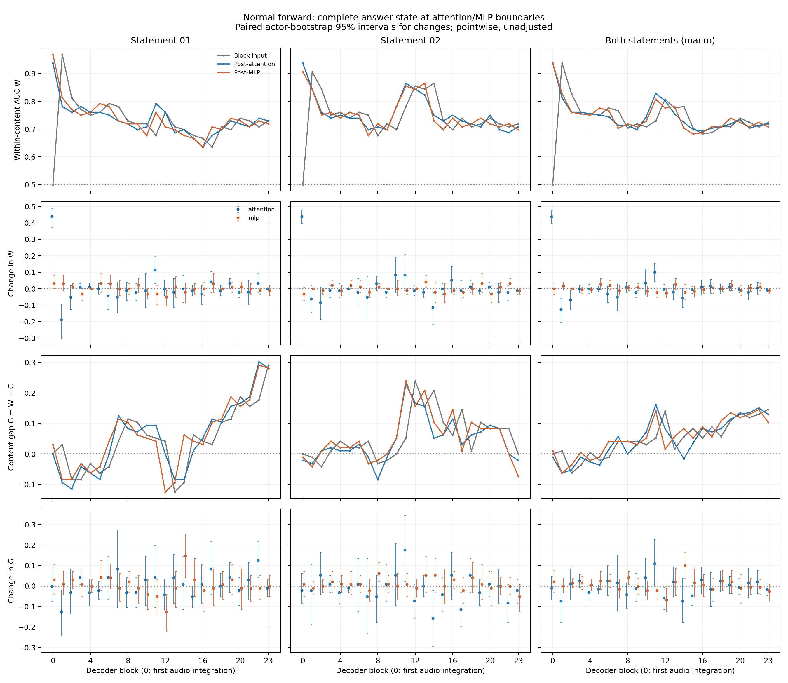

# Module C：Attention 与 MLP 边界上的回答状态可读性

2026-09-16。正常冻结forward，不做zero/ablation/patch。在每个Qwen block保存完整answer residual的输入、Attention residual add之后、MLP residual add之后，沿用上一轮完全匹配的within/cross probe。

## 结果与统一图



[PDF](./analysis/attention_mlp_readability.pdf)。三列分别为**测试statement01、02及两句等权平均**。四行分别是within-content AUC W、Attention/MLP之后的ΔW、content gap G=W−cross AUC、两种更新后的ΔG。灰色input、蓝色post-attention、橙色post-MLP；变化量的误差线为配对actor-bootstrap的点态95%区间，未校正多层比较。曲线使用同一actor×statement测试折内AUC的平均值，非pooled OOF AUC。

**本轮可以把within-content线性可读性的净下降定位到自然计算中的Attention边界；但content gap增加尚不能在合并结果中明确归属于Attention或MLP。** 这是观察性的probe性能定位，不是Attention不可逆删除情绪或某种ablation可以恢复模型行为的证明。

## 问题1：within-content可读性在哪一步下降？

先把block0的初次信息写入分开：其answer input在全部192条样本间完全一致，W=0.5000；Attention后W=0.9375；MLP后W仍为0.9375。这里的Attention首先让回答位置出现很强的情绪线性可读性。

在随后预先固定的blocks1–23中，取每个组件的**有符号变化之和**，不挑选负向层：

| 测试statement | Attention ΣΔW [95%CI] | MLP ΣΔW [95%CI] |
|---|---:|---:|
| 01 | −0.2500 [−0.4583, −0.0521] | ≈0 [−0.1771, 0.1875] |
| 02 | −0.2083 [−0.4063, −0.0208] | ≈0 [−0.1771, 0.1875] |
| 两句平均 | **−0.2292 [−0.3802, −0.0833]** | **≈0 [−0.1146, 0.1094]** |

两类组件的点估计之和等于block0输出0.9375→block23输出0.7083的净变化−0.2292。这里的加和只是沿观察到的AUC轨迹做差后的望远镜恒等式，**不是因果mediation比例，也不是信息量分解**。

具体例子，block1的合并W：

```text
input       0.9375
  Attention −0.1250
post-attn   0.8125
  MLP       +0.0156
post-MLP    0.8281
```

这不意味着每层Attention都降低W：例如block11，W从0.7292经Attention升到0.8281，再经MLP降到0.8073。MLP净和接近零也不等于每层MLP没有作用，其正负变化会相互抵消；CI仍允许一定幅度的净变化。所有层及配对区间均完整保存，没有按结果选择“关键层”。

## 问题2：content gap在哪一步增加？

同样汇总blocks1–23：

| 测试statement | Attention ΣΔG [95%CI] | MLP ΣΔG [95%CI] |
|---|---:|---:|
| 01 | +0.1875 [−0.1354, 0.5208] | +0.0625 [−0.2604, 0.3958] |
| 02 | −0.2604 [−0.5313, ≈0] | +0.1979 [0.0521, 0.3542] |
| 两句平均 | **−0.0365 [−0.2344, 0.1615]** | **+0.1302 [−0.0417, 0.3021]** |

合并G从block0输出0.0104升到block23输出0.1042，净增0.0938；Attention与MLP变化之和与此一致。MLP的点估计倾向增加gap，但合并区间跨零，不能把用户示意的“Attention降低W、MLP增加content dependence”当作已证实的完整机制分工。

Statement方向仍不对称。测试02时，MLP的ΣΔG为正且点态CI不跨零；测试01并没有同样明确的组件归属。测试02的Attention区间上界在原始CSV中约为−2.8e−16，应当视为数值零，不能借浮点符号宣称严格显著。这里的分组区间均未校正，不能替代合并结果或证明方向旋转。

此外，G是两个可读性指标的差，增加既可能来自within提高，也可能来自cross降低。测试02的MLP净ΔW≈0而净Δcross AUC≈−0.1979，因此其gap增加对应较弱的跨文本排序迁移，而不是句内信息增加。报告同时保存cross变化，避免把所有ΔG统称为某种已证实的表示机制。

## 取样位置与协议

核对实际安装的transformers4.57.6 Qwen2DecoderLayer.forward：input_layernorm的pre-hook读取block input；post_attention_layernorm的pre-hook读取Attention residual add之后、下一次RMSNorm之前的完整状态；block forward-hook读取MLP residual add之后的完整状态。不是读取归一化后的向量，也不是读取单独Attention/MLP update。观察hook只拷贝数据并返回None。

同样192条音频、24actors、96matched pairs、intensity01、seed1234、原prompt/候选，正常decoder forward每样本一次。回答位置330，prefix331；每种状态保存[192,24,896]。全部post-MLP向量与Module B、相邻block输入/输出、最终RMSNorm、native margins逐元素一致；两次residual add重建最大误差均0。

每个测试actor/statement：within训练其他23actors的同一句，cross训练其他23actors的另一句，两边92训练/相同4测试样本。Train-only StandardScaler、C=1 logistic、lbfgs/max_iter5000、happy=1、seed20260915，无调参。精确相同的24个out状态与23个下一层input状态复用已有within/cross OOF，只对24个post-attention及block0 input进行2,400个新probe拟合。

10,000次actor-cluster bootstrap在所有状态、条件及两句间共用actor multiplicities，直接计算配对ΔW/ΔG。区间条件于已拟合probe，不重拟合，点态、未校正。三个时间点都使用各自拟合的线性读出，因此变化反映本协议下的线性可达性，不能等同于模型本身的logit变化或信息论意义的信息消失。两句话、24actors、每测试fold仅4样本及有限样本拟合限制了结论。

## 交付与验证

- [状态指标](./analysis/state_summary.csv)、[每层组件变化](./analysis/component_deltas.csv)、[预先固定区间的有符号和](./analysis/aggregate_deltas.csv)
- [OOF分数](./analysis/oof_predictions.csv)、[逐fold指标](./analysis/fold_metrics.csv)、[训练/测试划分](./analysis/fold_membership.csv)
- [提取位置、源码与hash](./sublayer_states.json)、[分析协议及来源](./analysis/analysis.json)、[实验口径](./experiment-spec.md)、[复现命令](./reproduce.sh)、[验证](./verification.json)

新增两个脚本及对应测试，复用现有加载/输入/fold/统计工具，没有新增依赖或修改模型计算。向量缓存保留本地和biggpu、排除Git。远端108项测试通过；本地81通过、25因可选依赖缺失跳过。72种状态×2条件×192条样本共27,648条唯一OOF记录；全部post-MLP状态指标和CI复现上一轮；所有配对bootstrap draws中的组件和与起终点变化最大差2.22e−16。真实小型Qwen测试确认这些观察hooks不改变forward输出。
